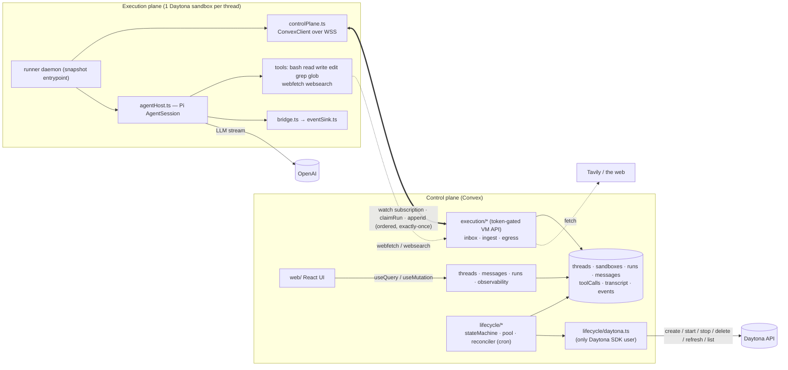
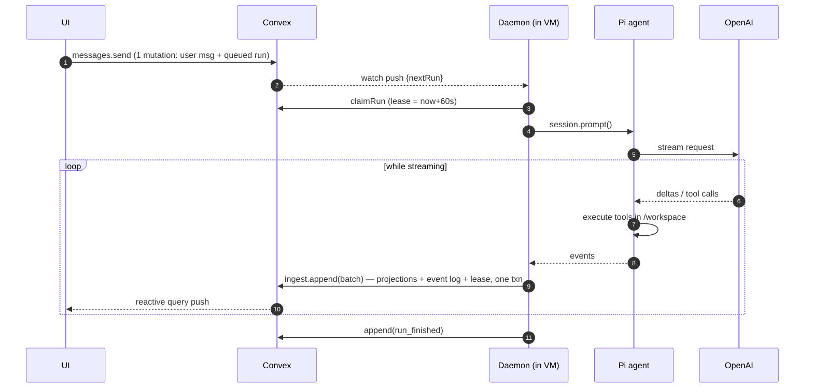
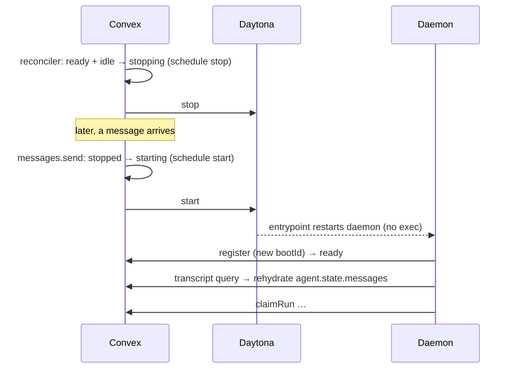
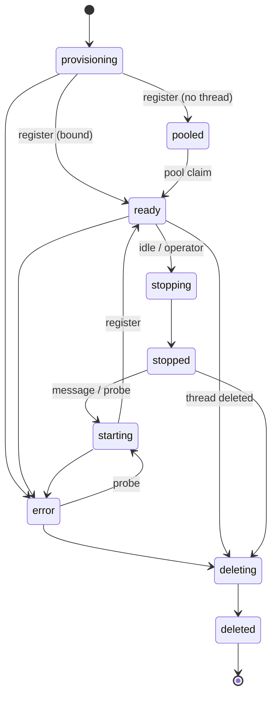

# Pi Agent Chatbot — Daytona + Convex

A minimal chatbot where **every thread gets its own Daytona sandbox**, the **Pi coding agent runs inside that sandbox** with 8 tools (`bash read write edit grep glob webfetch websearch`), and **Convex is the control plane** (database, API, orchestration). A plain React UI streams responses and shows exactly what the agent and the infrastructure are doing.

The interesting part is the architecture, not the feature list:

1. **Zero Daytona API calls on the per-message path.** The daemon in each VM is a Convex client subscribed to its own inbox. A new message reaches the VM as a query push over a WebSocket that is already open. There is no exec call, no preview-proxy hop, and no process spawn.
2. **The VM keeps no conversation state.** Convex stores the exact LLM transcript. Sandboxes can be stopped, restarted, or deleted and recreated without losing the conversation.
3. **One explicit lifecycle state machine and one reconciler.** Leases replace heartbeats, and Daytona's auto-stop is a dead-man's switch.
4. **Warm pool with race-free claims**, plus a benchmark harness that separates control-plane overhead from LLM latency.
5. **Egress broker.** Web tools run in the VM, but their network request goes through Convex. The Tavily key never enters a sandbox, and every call is logged.
6. **Event log and UI projections are written in one transaction**, with adaptive batching of token deltas.

---

## Architecture



`shared/protocol.ts` is the versioned contract between the planes. Boundaries are enforced by ESLint `no-restricted-imports`:

| Rule | Enforced where |
|---|---|
| Only `convex/lifecycle/daytona.ts` imports `@daytona/sdk` | `convex/**` |
| Only `runner/src/controlPlane.ts` talks to Convex | `runner/src/**` |
| The VM only knows `shared/protocol.ts`, never control-plane modules | `runner/src/**` |
| The UI talks to Convex only, through the generated `api` | `web/**` |

## How a message flows



### New thread (warm pool or cold)

```mermaid
sequenceDiagram
  participant U as UI
  participant C as Convex
  participant Y as Daytona
  participant D as Daemon
  U->>C: threads.create
  alt pooled sandbox available
    C->>C: pooled → ready (same serializable txn; no locks)
    C-->>D: watch push {threadId} — daemon pre-builds the agent
  else pool empty (or cold)
    C->>C: insert provisioning row, schedule create
    C->>Y: create(snapshot, env: CONVEX_URL, SANDBOX_TOKEN)
    Y-->>D: entrypoint starts daemon
    D->>C: register → ready
  end
  Note over U,C: create returns immediately; messages sent meanwhile just queue
```

### Resume after idle stop



If the VM was deleted behind our back, `start`, probe, or the `observe` cron gets not-found. The thread then points at a fresh sandbox, and the transcript rehydrates the conversation. A `thread.workspace_reset` event makes the lost workspace explicit.

## Sandbox lifecycle



- **One transition table** (`convex/lifecycle/stateMachine.ts`). Illegal transitions throw. Every transition writes a `sandbox.transition` event in the same transaction.
- **One reconciler** (`reconciler.ts`, cron every 30 s, database-only) handles:
  - expired leases
  - wake-ups for queued work
  - idle stop
  - stuck operations and boot timeouts
  - error recovery (probe → start, recover, or recreate)
  - pool top-up and snapshot rollover
  - Daytona activity refresh
- **Drift detection** (`daytona.observe`, cron every 2 min) makes one `list` call by label. It detects sandboxes that were deleted or stopped behind our back, and VMs leaked with no live row.
- **Dead-man's switch:** sandboxes are created with Daytona `autoStopInterval`. Daemon traffic does not count as Daytona activity, so the reconciler refreshes activity for live sandboxes. If the control plane disappears, the VMs stop on their own.
- **`pendingOp`** dedupes scheduled Daytona operations across ticks.
- **Circuit breaker:** after 3 failed sandboxes for a thread in 10 minutes, recreation stops and queued runs fail with a visible reason.
- **Crash recovery inside the VM:** the entrypoint is a restart loop. A new `bootId` on register immediately fails runs claimed by the dead boot, instead of waiting for the lease.

## Data model

| Table | Purpose | Key fields / indexes |
|---|---|---|
| `threads` | conversation | `title, model, sandboxId, transcriptSeq, lastActivityAt` |
| `sandboxes` | thread ↔ VM mapping and lifecycle | `state, threadId?, daytonaId, tokenHash, snapshot, bootId, pendingOp, spans{createMs,startMs,daemonBootMs,readyMs}`; `by_state, by_tokenHash, by_thread, by_daytonaId` |
| `runs` | one user turn; strict FIFO | `status, bootId, leaseExpiresAt, cancelRequestedAt, lastSeq, queuedAt, claimedAt, endedAt` (control-plane clock), `vmStartedAt, vmLlmRequestAt, vmFirstTokenAt, vmEndedAt` (VM clock), `usage` |
| `messages` | chat bubbles (projection) | `role, text, thinking, status, usage`; `by_run_key` |
| `toolCalls` | tool history (projection) | `seq, name, args, status, liveOutputTail, result{text,details,truncated}, durationMs` |
| `transcript` | exact Pi `AgentMessage`s for rehydration | `threadId, seq, raw` |
| `events` | append-only timeline and audit log | `type, source (vm/cp), at, vmAt, durationMs, data` |

## Protocol (`shared/protocol.ts`, `PROTOCOL_VERSION = 1`)

The VM may call exactly these functions, each authenticated by the sandbox token. The token is 32 random bytes in the VM's env; Convex stores only its SHA-256.

| Function | Kind | What it does |
|---|---|---|
| `execution/inbox:register` | mutation | Registers `{bootId, protocolVersion, runnerVersion, bootMs}`, moves the sandbox to `pooled`/`ready`, fails runs claimed by the previous boot, and rejects protocol mismatches. |
| `execution/inbox:watch` | subscription | Returns `{threadId, model, nextRun, cancelRunId}`. |
| `execution/inbox:transcript` | query | Returns the thread's transcript for rehydration. |
| `execution/inbox:claimRun` | mutation | Takes a lease. Only the head of the FIFO, and only the first claim, succeeds. |
| `execution/ingest:append` | mutation | Takes `RunnerEvent[]`. Idempotent (`seq` ≤ `lastSeq` is skipped), extends the lease, and returns `{accepted, cancelRequested}`. |
| `execution/egress:webfetch` / `websearch` | action | Brokered network access, logged on the timeline. |

`RunnerEvent` is one of: `run_started`, `llm_request`, `assistant_delta` (coalesced), `message_end{raw}`, `tool_start`, `tool_output` (coalesced tail), `tool_end{result, durationMs}`, `run_finished`, `keepalive`, `log`.

**Event sink.** The sink keeps at most one `append` in flight. Deltas that arrive during a write merge into the next batch, so write volume tracks network latency, not token rate. In a local run, 44 events went out in 21 writes. Failed writes are retried with the same seqs.

## Observability (the Inspector)

| Tab | Shows |
|---|---|
| **Timeline** | Per-run waterfall: queue → claim (control-plane clock), claim → LLM request, LLM → first token, then every tool with overlaps visible (VM clock). Also sandbox readiness spans. |
| **Tools** | Ordered tool history: inputs, first line of output, duration. |
| **Sandbox** | Every sandbox the thread has had (recreations included): Daytona id, snapshot, runner and protocol version, boot id, spans, lifecycle history. |
| **Events** | Live raw event log from both planes, filterable. |
| **Context** | The raw transcript: exactly what a rehydrated agent sees. |

## Performance

**What's on the hot path:** one `messages.send` mutation, a subscription push, and one `claimRun` mutation. Daytona is not involved.

Local measurement: `npx tsx scripts/bench.ts --local --n 30`. This runs a real Convex local backend and the real daemon in-process over WebSocket, with a faux LLM, on Windows. It isolates the control-plane path.

| metric | p50 | p95 |
|---|---:|---:|
| dispatch (queued → claimed, control-plane clock) | 20 ms | 22 ms |
| VM overhead (run_started → LLM request) | 0 ms | 1 ms |
| client send → first assistant text pushed back | 90 ms | 103 ms |

### Live numbers (real Daytona + OpenAI)

`npm run bench -- --n 5`, 2026-09-18, Convex dev deployment (US) + Daytona target `us`, model `gpt-5.4-mini`, prompt "Reply with exactly the word: ok".

| scenario | metric | p50 | p95 |
|---|---|---:|---:|
| **hot** (message on a ready sandbox) | **dispatch** (queued → claimed) | **61 ms** | 220 ms |
| | VM overhead (run_started → LLM request) | 1 ms | 3 ms |
| | LLM time to first token | 729 ms | 1027 ms |
| | client send → first text on screen | 1173 ms | 1705 ms |
| **warm** (new thread from the pool) | `threads.create` mutation | 268 ms | 310 ms |
| | thread ready (client-observed) | **516 ms** | 558 ms |
| | first turn → first text | 1754 ms | 1946 ms |
| **cold** (new thread, no pool) | Daytona create | 754 ms | 4871 ms |
| | daemon boot (VM clock) | 1366 ms | 1571 ms |
| | request → registered | 2343 ms | 6164 ms |
| | thread ready (client-observed) | **2995 ms** | 6801 ms |
| **resume** (message to a stopped sandbox) | Daytona start | 724 ms | 800 ms |
| | daemon boot | 1303 ms | 1364 ms |
| | request → registered | 2145 ms | 2185 ms |
| | client send → first text | **3448 ms** | 3862 ms |

**The point of the split:** on the hot path the control plane costs **61 ms** against **729 ms** of model latency — infrastructure is ~8% of time-to-first-token, and Daytona is not called at all. The warm pool turns a ~3 s cold start into a ~0.5 s one, and it's a single mutation (268 ms of that 516 ms is the round trip to create the thread).

## Tradeoffs

- **The OpenAI key is in the VM** by default, because the agent calls the model directly. Proxying the LLM through Convex would add a hop before the first token. Mitigation: set `DAYTONA_OPENAI_SECRET` to use a Daytona org Secret; the VM then only sees a placeholder that Daytona swaps on egress to `api.openai.com`.
- **Web tools depend on the control plane.** That is the price of the egress broker and of Tier 1/2 allowlists. `webfetch` runs from Convex's network, not the VM's.
- **Two clocks.** Within-run spans use the VM clock; queue and claim use the control-plane clock. No span subtracts across clocks.
- **Batching trades streaming granularity for writes.** It's adaptive: roughly one write per round trip.
- **The warm pool costs idle compute.** `SANDBOX_POOL_SIZE=0` disables it.
- **Strict FIFO per thread.** Later messages queue; the agent can't be steered mid-run. Stop cancels.
- **Duplicated storage.** `transcript` duplicates what `messages` and `toolCalls` hold, deliberately: one is exact model context, the others are UI projections.
- **Tool output is capped** at 64k chars per result (Convex's document limit is 1 MiB). Pi's own tools truncate first.
- **Pi compaction is disabled** so the stored transcript stays exact. Very long threads will eventually hit the model's context window.
- **Non-goals:** auth (operator endpoints are unauthenticated), UI polish, production hardening.

## Setup

Requirements: Node ≥ 22.19 (22.12+ works with warnings), a Daytona account, an OpenAI key, and a Tavily key.

```bash
npm install                 # also installs runner/
npx convex dev              # log in, create a dev deployment (writes .env.local); keep running
cp .env.example .env.local  # merge in: DAYTONA_API_KEY, OPENAI_API_KEY, TAVILY_API_KEY
npm run env:push            # copy settings into the Convex deployment
npm run snapshot            # build the runner image on Daytona, set DAYTONA_SNAPSHOT
npm run dev:web             # UI
npm run bench               # benchmarks (optional)
```

### Environment variables

| Variable | Where | Required | Default | Notes |
|---|---|---|---|---|
| `DAYTONA_API_KEY` | Convex | yes | | |
| `DAYTONA_API_URL`, `DAYTONA_TARGET` | Convex | no | SDK default | |
| `DAYTONA_SNAPSHOT` | Convex | yes | | Set by `npm run snapshot` |
| `OPENAI_API_KEY` | Convex → VM | yes | | Injected into sandboxes |
| `DAYTONA_OPENAI_SECRET` | Convex | no | | Daytona Secret name; keeps the real key out of VMs |
| `DEFAULT_MODEL` | Convex | no | `gpt-5.4-mini` | Any OpenAI id in pi-ai's registry |
| `TAVILY_API_KEY` | Convex | yes | | Never enters a VM |
| `SANDBOX_POOL_SIZE` | Convex | no | `1` | |
| `SANDBOX_IDLE_STOP_MINUTES` | Convex | no | `10` | |
| `DAYTONA_AUTOSTOP_MINUTES` | Convex | no | `30` | Dead-man's switch |
| `CONVEX_DEPLOYMENT`, `VITE_CONVEX_URL` | `.env.local` | yes | | Written by `npx convex dev` |

In-VM variables (set by the control plane): `CONVEX_URL`, `SANDBOX_TOKEN`, `OPENAI_API_KEY`, `WORKSPACE_DIR=/workspace`.

## Testing

| Command | What it covers |
|---|---|
| `npm run typecheck` | convex, web, scripts, runner |
| `npm run lint` | includes the plane-boundary rules |
| `npm test` | **Convex** (convex-test): state machine, ingest ordering/replay/lease/projections, FIFO claim, cancel, reboot recovery, lease expiry, pool claims under concurrent creates, wake-on-message. **Runner** (vitest): event-sink coalescing/ordering/retry/cancel, bridge mapping of a recorded Pi stream. |
| `npm run spike:pi` | Real Pi `AgentSession` with a faux LLM: all 8 tools, rehydration, abort |
| `npm run e2e:local` | Both planes, no Daytona: real Convex functions ↔ real daemon over WebSocket (faux LLM); dispatch, streaming, projections, egress, FIFO, cancel, restart + rehydration |
| `npm run spike:daytona -- <snapshot>` | Live: env visible to the entrypoint, WSS subscription from the VM, daemon survives stop/start |
| `npm run e2e:daytona` | **Live acceptance** against real Daytona + OpenAI + Tavily: warm-pool thread, all 8 tools in one turn, stop mid-run, stop→resume (memory _and_ workspace survive), VM deleted behind our back → recreated with the conversation intact, then no orphaned sandboxes |

## Repo layout

```
shared/protocol.ts            contract between planes
convex/
  schema.ts validators.ts config.ts
  threads.ts messages.ts runs.ts observability.ts admin.ts crons.ts   UI + operator API
  execution/{auth,inbox,ingest,egress}.ts                              VM API (token-gated)
  lifecycle/{stateMachine,pool,reconciler}.ts lifecycle/daytona.ts     orchestration
runner/
  entrypoint.sh build.mjs
  src/{main,daemon,controlPlane,agentHost,bridge,eventSink}.ts
  src/tools/{index,glob,webfetch,websearch}.ts                         add a tool = 1 file + 1 line
web/src/{App,main}.tsx components/{ThreadList,Chat,ToolCallCard}.tsx components/inspector/*
infra/{snapshot,spikeDaytona}.ts   scripts/{bench,env-push,e2e-local,util}.ts
```
