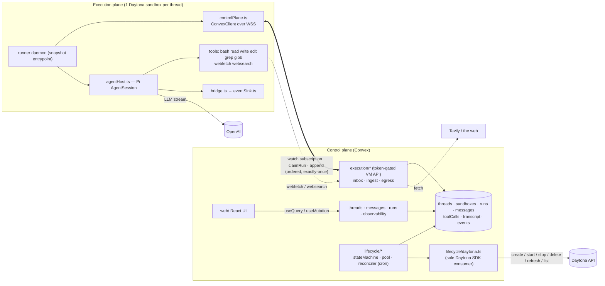
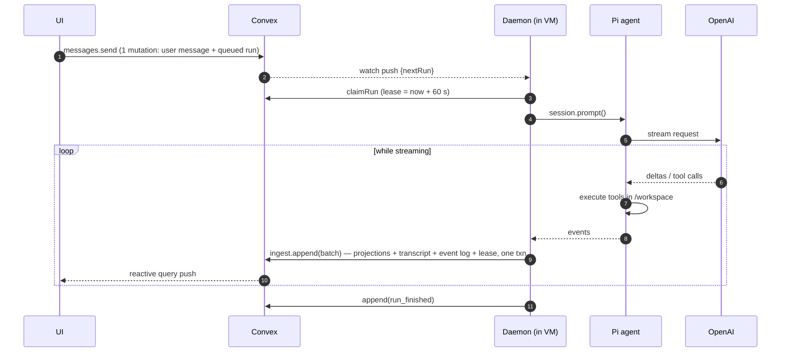
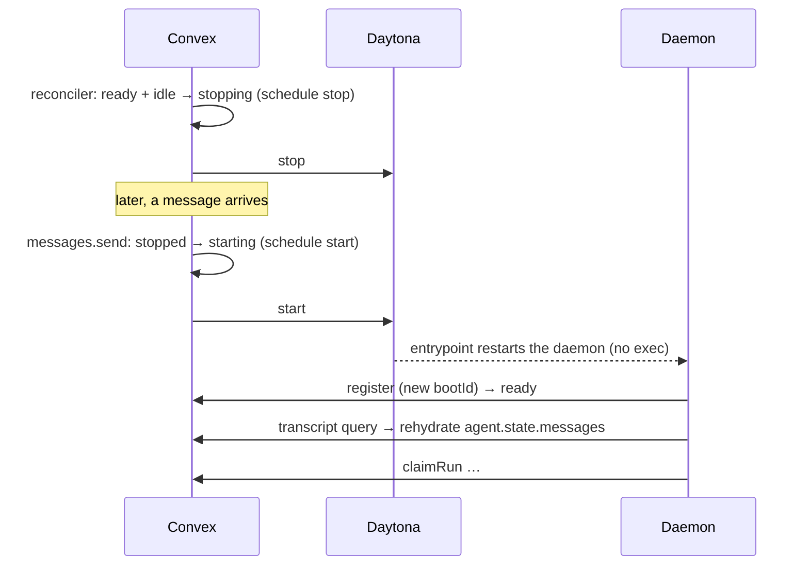
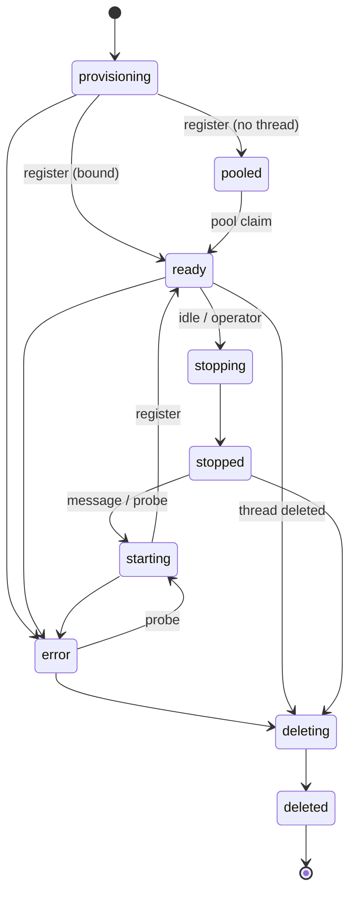

# Pi Agent Chatbot — Daytona + Convex

A chatbot in which **every conversation thread is backed by its own Daytona sandbox**, the **Pi coding agent executes inside that sandbox** with eight tools (`bash`, `read`, `write`, `edit`, `grep`, `glob`, `webfetch`, `websearch`), and **Convex serves as the control plane** — database, API, orchestration, and scheduling. A React client streams responses and exposes the behaviour of both the agent and the infrastructure through an inspector.

The system is organised as two planes joined by a single versioned contract:

| Plane | Runtime | Responsibility |
|---|---|---|
| **Control plane** | Convex | Durable state, public and operator API, sandbox lifecycle, brokered egress, event log |
| **Execution plane** | One Daytona sandbox per thread | The Pi agent session, tool execution, the LLM stream |

---

## Contents

- [Architecture decisions](#architecture-decisions)
- [System architecture](#system-architecture)
- [How the components interact](#how-the-components-interact)
- [Sandbox lifecycle](#sandbox-lifecycle)
- [Data model](#data-model)
- [Plane protocol](#plane-protocol)
- [Observability](#observability)
- [Performance](#performance)
- [Tradeoffs and limitations](#tradeoffs-and-limitations)
- [Setup](#setup)
- [Configuration](#configuration)
- [Testing](#testing)
- [Repository layout](#repository-layout)

---

## Architecture decisions

The six decisions below define the system. Each is stated with the problem it addresses, the mechanism that implements it, and its consequence.

### 1. No Daytona API call on the per-message path

**Problem.** Invoking the sandbox provider to execute a command per message places a provider round trip, a proxy hop, and a process spawn in front of every turn.

**Mechanism.** The daemon inside each sandbox is itself a Convex client. It holds an open WebSocket subscription to `execution/inbox:watch`, scoped to its own sandbox. A new message is a database write; the subscription push delivers it to the VM. The daemon then claims the run with a single mutation.

**Consequence.** The per-message path is one mutation, one subscription push, and one claim mutation. Daytona is not contacted. See [Performance](#performance).

### 2. The sandbox holds no conversation state

**Problem.** If conversational memory lives in the VM, the VM becomes irreplaceable: stopping it, restarting it, or losing it destroys the conversation.

**Mechanism.** Convex stores the exact Pi `AgentMessage` transcript in the `transcript` table. On boot, the daemon queries that transcript and rehydrates `agent.state.messages` before claiming work.

**Consequence.** Sandboxes are disposable. They can be idle-stopped, restarted, or deleted and recreated without conversation loss. Only the on-disk workspace is lost on recreation, and that is recorded explicitly as a `thread.workspace_reset` event.

### 3. One transition table and one reconciler

**Problem.** Lifecycle logic distributed across call sites produces states that cannot be explained and cleanup paths that are never exercised.

**Mechanism.** All sandbox state changes pass through `convex/lifecycle/stateMachine.ts`; illegal transitions throw. A single cron-driven reconciler (`convex/lifecycle/reconciler.ts`, every 30 s, database-only) owns every periodic correction. Liveness uses leases rather than heartbeats — a claimed run carries an expiry that ingest extends — and Daytona's `autoStopInterval` acts as a dead-man's switch should the control plane disappear entirely.

**Consequence.** Lifecycle behaviour is auditable from two files, and every transition writes a `sandbox.transition` event in the same transaction that performs it.

### 4. A warm pool with race-free claims

**Problem.** Cold-starting a sandbox costs seconds, and that latency would otherwise be incurred on every new thread.

**Mechanism.** The reconciler maintains `SANDBOX_POOL_SIZE` pre-booted, unbound sandboxes in the `pooled` state. `threads.create` claims one inside its own transaction. Convex mutations are serializable, so concurrent thread creation cannot claim the same sandbox and no explicit locking is required.

**Consequence.** New-thread readiness drops from roughly 2.6 s to roughly 0.5 s. Setting `SANDBOX_POOL_SIZE=0` disables the pool and always cold-starts.

### 5. Brokered egress for the web tools

**Problem.** Search and fetch require credentials and network reach. Placing the Tavily key in a sandbox would expose it to agent-executed code; independently of that, Daytona Tier 1/2 sandboxes cannot reach arbitrary hosts.

**Mechanism.** `webfetch` and `websearch` are registered as ordinary Pi tools inside the VM, but their implementations call `execution/egress:webfetch` / `:websearch` on Convex, authenticated by the sandbox token. The outbound HTTP request originates from Convex.

**Consequence.** The Tavily key never enters a sandbox, and every outbound call is logged to the event timeline.

### 6. Projections and the event log are written in one transaction

**Problem.** A separate audit log drifts from the UI state it is supposed to explain.

**Mechanism.** `execution/ingest:append` accepts a batch of `RunnerEvent`s and, in a single Convex mutation, applies the message and tool-call projections, appends transcript entries, writes the event log, and extends the run lease. The runner's event sink keeps at most one `append` in flight; deltas arriving during a write merge into the next batch.

**Consequence.** The UI can never show state the log does not explain. Write volume tracks network round-trip time rather than token rate — in a recorded local run, 44 events were delivered in 21 writes.

---

## System architecture



### Plane boundaries

`shared/protocol.ts` is the only type-level contract that crosses the boundary. It declares `PROTOCOL_VERSION`, the sandbox and run state enums, the tool names and result shapes, the `RunnerEvent` union, and typed references to the functions the VM is permitted to call. Its constraints are enforced mechanically by ESLint `no-restricted-imports`:

| Rule | Scope | Exemption |
|---|---|---|
| Only `convex/lifecycle/daytona.ts` may import `@daytona/sdk` | `convex/**` | that file |
| The control plane must not import the execution plane | `convex/**` | — |
| Only `runner/src/controlPlane.ts` may import `convex` | `runner/src/**` | that file and `spikeConvex.ts` |
| The VM may import `shared/protocol.ts`, never control-plane modules | `runner/src/**` | — |
| The UI reaches Convex only through the generated `api` | `web/**` | — |

---

## How the components interact

### Per-message path



Runs are strict FIFO per thread. `watch` returns only the oldest queued run, and only when no other run is active; `claimRun` succeeds only for the head of the queue, and only on its first call.

### Thread creation — warm and cold

```mermaid
sequenceDiagram
  participant U as UI
  participant C as Convex
  participant Y as Daytona
  participant D as Daemon
  U->>C: threads.create
  alt pooled sandbox available
    C->>C: pooled → ready (same serializable txn; no locks)
    C-->>D: watch push {threadId} — daemon pre-builds the agent
  else pool empty (or cold requested)
    C->>C: insert provisioning row, schedule create
    C->>Y: create(snapshot, env: CONVEX_URL, SANDBOX_TOKEN)
    Y-->>D: entrypoint starts the daemon
    D->>C: register → ready
  end
  Note over U,C: create returns immediately; messages sent meanwhile are queued
```

### Resume after an idle stop



### Recovery when a sandbox disappears

If the VM is deleted outside the system's control, the condition surfaces as a not-found result from `start`, from a probe, or from the `daytona.observe` cron. The thread is then repointed at a fresh sandbox and the transcript rehydrates the conversation. The lost workspace is recorded as a `thread.workspace_reset` event, so the discontinuity is visible in the UI rather than silent.

---

## Sandbox lifecycle



**Reconciler** — `convex/lifecycle/reconciler.ts`, cron every 30 s, database-only (it issues no Daytona calls of its own). It handles:

- expired run leases;
- wake-ups for queued work on a stopped sandbox;
- idle stop after `SANDBOX_IDLE_STOP_MINUTES`;
- stuck operations (`opTimeoutMs`, 3 min) and boot timeouts (`bootTimeoutMs`, 4 min);
- error recovery — probe, then start, recover, or recreate;
- pool top-up and snapshot rollover;
- Daytona activity refresh (`refreshEveryMs`, 5 min).

**Drift detection** — `convex/lifecycle/daytona.observe`, cron every 2 min. It issues a single `list` call filtered by label, detecting both sandboxes deleted or stopped outside the system and VMs leaked with no corresponding live row.

**Dead-man's switch.** Sandboxes are created with Daytona `autoStopInterval` (`DAYTONA_AUTOSTOP_MINUTES`, default 30). Daemon WebSocket traffic does not register as Daytona activity, so the reconciler refreshes activity for live sandboxes. Should the control plane become unavailable, the sandboxes stop without further intervention.

**Operation dedupe.** `pendingOp` records the in-flight Daytona operation on the sandbox row, so repeated reconcile ticks do not schedule the same operation twice.

**Circuit breaker.** After three failed sandboxes for one thread within ten minutes (`BREAKER_FAILURES` and `BREAKER_WINDOW_MS` in `convex/lifecycle/pool.ts`), recreation stops, queued runs fail with a visible reason, and a `thread.breaker_open` event is written. This prevents a bad snapshot, a missing key, or an exhausted quota from consuming Daytona resources in a loop.

**In-VM crash recovery.** The snapshot entrypoint is a restart loop. A fresh `bootId` presented at `register` immediately fails runs claimed by the dead boot, rather than waiting out the lease.

---

## Data model

| Table | Purpose | Key fields and indexes |
|---|---|---|
| `threads` | Conversation; owns the sandbox pointer and transcript cursor | `title, model, sandboxId?, transcriptSeq, lastActivityAt`; `by_lastActivity` |
| `sandboxes` | Thread ↔ VM mapping and lifecycle; one row per sandbox ever created | `state, stateChangedAt, threadId?, daytonaId?, tokenHash, snapshot, cold, bootId?, protocolVersion?, runnerVersion?, pendingOp?, spans{createMs, startMs, daemonBootMs, requestedAt, readyMs}`; `by_state, by_tokenHash, by_thread, by_daytonaId` |
| `runs` | One user turn; strict FIFO per thread, at most one active | `status, sandboxId?, bootId?, leaseExpiresAt?, cancelRequestedAt?, lastSeq, turns, usage?`; control-plane clock `queuedAt, claimedAt?, endedAt?`; VM clock `vmStartedAt?, vmLlmRequestAt?, vmFirstTokenAt?, vmEndedAt?`; `by_thread_status, by_status` |
| `messages` | Chat bubbles (projection of the event log) | `role, text, thinking?, status, stopReason?, usage?`; `by_thread, by_run_key` |
| `toolCalls` | Tool history (projection of the event log) | `seq, toolCallId, name, args, status, liveOutputTail?, result{text, details?, truncated}, vmStartedAt, durationMs?`; `by_thread, by_run_toolCallId` |
| `transcript` | Exact Pi `AgentMessage`s, used to rehydrate a fresh VM | `threadId, seq, runId, raw`; `by_thread_seq` |
| `events` | Append-only timeline and audit log for both planes | `type, source (vm \| cp), at, vmAt?, durationMs?, data?`; `by_thread, by_run, by_sandbox` |

`transcript` deliberately duplicates information held by `messages` and `toolCalls`: the former is exact model context, the latter are UI projections shaped for rendering.

---

## Plane protocol

Defined in `shared/protocol.ts`, `PROTOCOL_VERSION = 1`. The sandbox token is 32 random bytes injected into the VM environment; Convex stores only its SHA-256 (`sandboxes.tokenHash`). The VM may call exactly the following functions, each authenticated by that token.

| Function | Kind | Behaviour |
|---|---|---|
| `execution/inbox:register` | mutation | Registers `{bootId, protocolVersion, runnerVersion, bootMs}`, moves the sandbox to `pooled` or `ready`, fails runs claimed by the previous boot, and rejects protocol mismatches. |
| `execution/inbox:watch` | query (held as a subscription) | Returns `{sandboxId, state, threadId, model, nextRun, cancelRunId}`. |
| `execution/inbox:transcript` | query | Returns the thread's transcript for rehydration. |
| `execution/inbox:claimRun` | mutation | Takes a 60 s lease (`RUN_LEASE_MS`). Succeeds only for the head of the FIFO queue, and only on the first claim. |
| `execution/ingest:append` | mutation | Accepts `RunnerEvent[]`. Idempotent — events with `seq ≤ lastSeq` are skipped — extends the lease, and returns `{ackSeq, accepted, cancelRequested}`. |
| `execution/egress:webfetch` | action | Brokered HTTP fetch, logged on the timeline. |
| `execution/egress:websearch` | action | Brokered Tavily search, logged on the timeline. |

`RunnerEvent` is one of: `run_started`, `llm_request`, `assistant_delta` (coalesced), `message_end{raw}`, `tool_start`, `tool_output` (coalesced tail), `tool_end{result, durationMs}`, `run_finished`, `keepalive`, `log`.

**Shared limits.** `RUN_LEASE_MS` 60 s · `KEEPALIVE_MS` 20 s · `MAX_TOOL_OUTPUT_CHARS` 64 000 · `LIVE_OUTPUT_TAIL_CHARS` 4 000 · `DEFAULT_WORKSPACE_DIR` `/workspace`.

**Event sink.** `runner/src/eventSink.ts` keeps at most one `append` in flight and assigns a monotonic `seq` per run. Deltas arriving while a write is outstanding merge into the next batch, so write volume is bounded by round-trip latency rather than token rate. Failed writes are retried with the same `seq` values, which `append` deduplicates.

---

## Observability

The inspector is a five-tab panel beside the chat, backed by `convex/observability.ts`.

| Tab | Contents |
|---|---|
| **Timeline** | Per-run waterfall: queue → claim (control-plane clock), claim → LLM request, LLM request → first token, then every tool with overlaps visible (VM clock). Also shows sandbox readiness spans. |
| **Tools** | Ordered tool history: inputs, first line of output, duration. |
| **Sandbox** | Every sandbox the thread has used, recreations included: Daytona id, snapshot, runner and protocol version, boot id, spans, lifecycle history. |
| **Events** | Live raw event log from both planes, filterable. |
| **Context** | The raw transcript — exactly what a rehydrated agent would see. |

Spans are never subtracted across clocks: within-run spans use the VM clock, queue and dispatch use the control-plane clock.

---

## Performance

The per-message hot path comprises one `messages.send` mutation, one subscription push, and one `claimRun` mutation. Daytona is not involved.

### Control-plane isolation (local)

`npx tsx scripts/bench.ts --local --n 30` runs a real Convex local backend with the real daemon in-process over WebSocket against a faux LLM, on Windows. This isolates control-plane cost from model latency.

| Metric | p50 | p95 |
|---|---:|---:|
| dispatch (queued → claimed, control-plane clock) | 20 ms | 22 ms |
| VM overhead (`run_started` → LLM request, VM clock) | 0 ms | 1 ms |
| client send → first assistant text pushed back | 90 ms | 103 ms |

### End-to-end (real Daytona + OpenAI)

`npm run bench`, 2026-09-18, Convex dev deployment (US) with Daytona target `us`, model `gpt-5.4-mini`, prompt `"Reply with exactly the word: ok"`. The raw samples are committed in `bench-results.json`; n = 3 per scenario, so the p95 column is the maximum observed sample.

| Scenario | Metric | p50 | p95 |
|---|---|---:|---:|
| **hot** (message on a ready sandbox) | **dispatch** (queued → claimed) | **116 ms** | 124 ms |
| | VM overhead (`run_started` → LLM request) | 1 ms | 4 ms |
| | LLM time to first token | 1506 ms | 1586 ms |
| | client send → first text on screen | 2085 ms | 2129 ms |
| | client send → run complete | 2390 ms | 2444 ms |
| **warm** (new thread from the pool) | `threads.create` mutation | 278 ms | 279 ms |
| | thread ready (client-observed) | **533 ms** | 535 ms |
| | first turn → first text | 2273 ms | 3357 ms |
| **cold** (new thread, no pool) | Daytona `create` | 553 ms | 747 ms |
| | daemon boot (VM clock) | 1402 ms | 1448 ms |
| | request → registered | 2000 ms | 2019 ms |
| | thread ready (client-observed) | **2647 ms** | 3327 ms |
| **resume** (message to a stopped sandbox) | Daytona `start` | 804 ms | 811 ms |
| | daemon boot | 1619 ms | 1635 ms |
| | request → registered | 2406 ms | 2462 ms |
| | dispatch (includes start + boot) | 2535 ms | 2590 ms |
| | client send → first text | **3906 ms** | 4124 ms |

**Interpretation.** On the hot path the control plane accounts for 116 ms against 1506 ms of model latency — approximately 6 % of the 2085 ms client-observed time to first text — and Daytona is not called. The warm pool reduces a ~2.6 s cold start to ~0.5 s at the cost of a single mutation, 278 ms of which is the client round trip that creates the thread. On resume, dispatch is dominated by Daytona `start` plus daemon boot; the control plane's own contribution remains the ~120 ms visible in the hot case.

To reproduce: `npm run bench`, or `npm run bench -- --n 5 --only hot,resume` for a subset. Scenario and span definitions are documented at the top of `scripts/bench.ts`.

---

## Tradeoffs and limitations

**The OpenAI key is present in the VM by default.** The agent calls the model directly, because proxying the LLM stream through Convex would add a hop ahead of the first token. *Mitigation:* set `DAYTONA_OPENAI_SECRET` to the name of a Daytona organisation Secret. The VM then receives only a placeholder, which Daytona substitutes on egress to `api.openai.com`.

**The web tools depend on the control plane.** `webfetch` and `websearch` fail if Convex is unreachable, and they execute from Convex's network rather than the VM's. This is the cost of keeping the Tavily key out of sandboxes and of operating within Daytona Tier 1/2 egress allowlists.

**Two clocks.** The VM clock and the control-plane clock are not synchronised. Within-run spans use the former and queue/dispatch spans the latter; no reported span subtracts across them, at the cost of there being no single end-to-end timeline in one clock domain.

**Batching trades streaming granularity for write volume.** The sink is adaptive, producing approximately one write per round trip: on a fast connection granularity approaches per-delta, and on a slow one it coarsens rather than amplifying write volume.

**The warm pool consumes idle compute.** `SANDBOX_POOL_SIZE` pre-booted sandboxes are held at all times. Set it to `0` to trade start latency for cost.

**Strict FIFO per thread.** Messages sent during a run are queued rather than merged, so the agent cannot be steered mid-run. Stop cancels the active run.

**Storage is deliberately duplicated.** `transcript` overlaps `messages` and `toolCalls`; the former must remain byte-exact for rehydration, while the latter may be reshaped for the UI.

**Tool output is capped** at 64 000 characters per result, against a Convex document limit of 1 MiB. Pi's own tools truncate before this cap is reached.

**Pi compaction is disabled** so that the stored transcript remains an exact record. Sufficiently long threads will eventually exhaust the model's context window.

**Explicit non-goals.** Authentication (the operator endpoints in `convex/admin.ts` are unauthenticated), UI polish, and production hardening are out of scope.

---

## Setup

Requirements: Node ≥ 22.19 (22.12 and above works, with warnings), a Daytona account, an OpenAI API key, and a Tavily API key.

```bash
npm install                 # also installs runner/
npx convex dev              # log in, create a dev deployment (writes .env.local); leave running
cp .env.example .env.local  # merge in DAYTONA_API_KEY, OPENAI_API_KEY, TAVILY_API_KEY
npm run env:push            # copy control-plane settings into the Convex deployment
npm run snapshot            # build the runner image on Daytona and set DAYTONA_SNAPSHOT
npm run dev:web             # start the UI
npm run bench               # benchmarks (optional)
```

`npm run dev` runs the Convex dev server and the Vite dev server together.

---

## Configuration

| Variable | Set in | Required | Default | Notes |
|---|---|---|---|---|
| `DAYTONA_API_KEY` | Convex | yes | — | |
| `DAYTONA_API_URL` | Convex | no | SDK default | |
| `DAYTONA_TARGET` | Convex | no | SDK default | e.g. `us` |
| `DAYTONA_SNAPSHOT` | Convex | yes | — | Written by `npm run snapshot` |
| `OPENAI_API_KEY` | Convex → VM | yes | — | Injected into sandboxes |
| `DAYTONA_OPENAI_SECRET` | Convex | no | — | Daytona Secret name; keeps the real key out of VMs |
| `DEFAULT_MODEL` | Convex | no | `gpt-5.4-mini` | Any OpenAI model id in pi-ai's registry |
| `TAVILY_API_KEY` | Convex | yes | — | Never enters a VM |
| `SANDBOX_POOL_SIZE` | Convex | no | `1` | `0` disables the warm pool |
| `SANDBOX_IDLE_STOP_MINUTES` | Convex | no | `10` | |
| `DAYTONA_AUTOSTOP_MINUTES` | Convex | no | `30` | Dead-man's switch |
| `CONVEX_DEPLOYMENT`, `VITE_CONVEX_URL` | `.env.local` | yes | — | Written by `npx convex dev` |

Variables injected into each sandbox by the control plane: `CONVEX_URL`, `SANDBOX_TOKEN`, `OPENAI_API_KEY`, `WORKSPACE_DIR=/workspace`.

Reconciler timings (`timing` in `convex/config.ts`) are intentionally not environment-tunable: they are safety rails rather than product settings.

---

## Testing

| Command | Coverage |
|---|---|
| `npm run typecheck` | `convex`, `web`, `scripts`, `runner` |
| `npm run lint` | typescript-eslint recommended, plus the plane-boundary rules |
| `npm test` | **Control plane** (convex-test): state machine; ingest ordering, replay, lease handling and projections; FIFO claim; cancel; reboot recovery; lease expiry; pool claims under concurrent creates; wake-on-message. **Runner** (vitest): event-sink coalescing, ordering, retry and cancel; bridge mapping of a recorded Pi stream. |
| `npm run spike:pi` | A real Pi `AgentSession` against a faux LLM: all eight tools, rehydration, abort |
| `npm run e2e:local` | Both planes without Daytona — real Convex functions against the real daemon over WebSocket with a faux LLM: dispatch, streaming, projections, egress, FIFO, cancel, restart and rehydration |
| `npm run spike:daytona -- <snapshot>` | Live checks: environment visible to the entrypoint, WSS subscription from the VM, daemon survival across stop/start |
| `npm run e2e:daytona` | Live acceptance against real Daytona, OpenAI and Tavily: warm-pool thread; all eight tools in one turn; stop mid-run; stop → resume with memory *and* workspace intact; VM deleted externally → recreated with the conversation intact; and finally, no orphaned sandboxes |

---

## Repository layout

```
shared/protocol.ts                      versioned contract between the planes

convex/
  schema.ts validators.ts config.ts     data model, shared validators, env config
  crons.ts                              reconcile (30 s), daytona observe (2 min)
  threads.ts messages.ts runs.ts        public UI API
  observability.ts admin.ts             inspector queries, operator endpoints
  lib/log.ts                            event-log helper
  execution/                            VM-facing API, token-gated
    auth.ts inbox.ts ingest.ts egress.ts
  lifecycle/                            orchestration
    stateMachine.ts pool.ts reconciler.ts
    daytona.ts                          sole @daytona/sdk consumer

runner/                                 the daemon baked into the snapshot
  entrypoint.sh build.mjs
  src/main.ts daemon.ts                 process entry, run loop
  src/controlPlane.ts                   sole Convex client in the VM
  src/agentHost.ts bridge.ts eventSink.ts
  src/tools/                            adding a tool = 1 file + 1 line in index.ts
    index.ts glob.ts webfetch.ts websearch.ts
  src/testing/faux.ts                   faux LLM used by tests and spikes
  src/spikePi.ts spikeConvex.ts

web/
  src/App.tsx main.tsx lib.ts
  src/components/                       Chat, ThreadList, ToolCallCard, StateBadge
  src/components/inspector/             Inspector, Timeline, Tools, Sandbox, Events, Context

infra/snapshot.ts spikeDaytona.ts       snapshot build, live Daytona spike
scripts/bench.ts env-push.ts util.ts    benchmarks, env sync
scripts/e2e-local.ts e2e-daytona.ts     end-to-end harnesses
```
